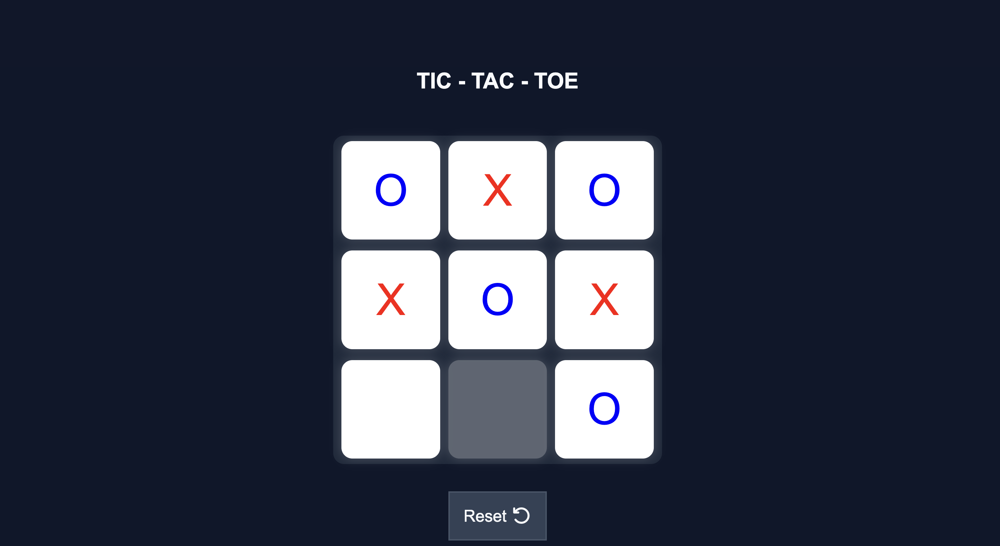
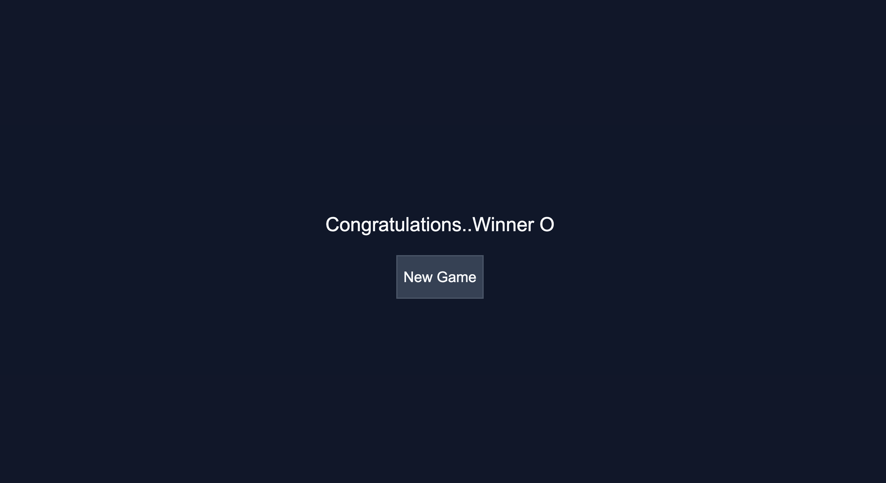

# 🎮 Tic-Tac-Toe

A responsive and interactive **Tic-Tac-Toe** game built using **HTML, CSS, and JavaScript**. The game offers a clean user interface, smooth gameplay, automatic winner detection, draw handling, and options to restart or start a new game.

---

## ✨ Features

- 🎯 Two-player gameplay (Player X vs Player O)
- 🏆 Automatic winner detection
- 🤝 Draw detection
- 🔄 Restart and New Game functionality
- 🎨 Interactive and responsive user interface
- ⚡ Built with Vanilla JavaScript (No frameworks)

---

## 🛠️ Technologies Used

- HTML5
- CSS3
- JavaScript (ES6)

---

## 📂 Project Structure

```text
tic-tac-toe/
│── index.html
│── style.css
│── script.js
│── README.md
│── LICENSE
└── assets/
    ├── game.png
    └── winner.png
```

> **Note:** If your screenshot filenames are different, update the image paths below accordingly.

---

## 📸 Screenshots

### 🎮 Gameplay



### 🏆 Winner Screen



---

## 🚀 Getting Started

### Clone the repository

```bash
git clone https://github.com/sailakshmigadupudi-afk/tic-tac-toe.git
```

### Navigate to the project directory

```bash
cd tic-tac-toe
```

### Run the project

Open the `index.html` file in your preferred web browser.

---

## 🎮 How to Play

1. The game starts with **Player O**.
2. Players take turns placing their symbols (**O** and **X**) on the board.
3. The first player to align three symbols horizontally, vertically, or diagonally wins.
4. If all nine cells are filled without a winner, the game ends in a draw.
5. Click **Restart** or **New Game** to begin another match.

---

## 🌱 Future Enhancements

- 🤖 Single-player mode with AI
- 📊 Scoreboard
- 🎵 Sound effects
- 🌙 Dark mode
- ✨ Confetti animation for winners
- 📱 Improved mobile experience

---

## 🤝 Contributing

Contributions are welcome!

1. Fork the repository.
2. Create a new feature branch.
3. Commit your changes.
4. Push to your branch.
5. Open a Pull Request.

---

## 📄 License

This project is licensed under the **MIT License**. See the `LICENSE` file for more details.

---

## 👨‍💻 Author

**Sai Lakshmi Gadupudi**

If you found this project helpful or interesting, consider giving it a ⭐ on GitHub!
